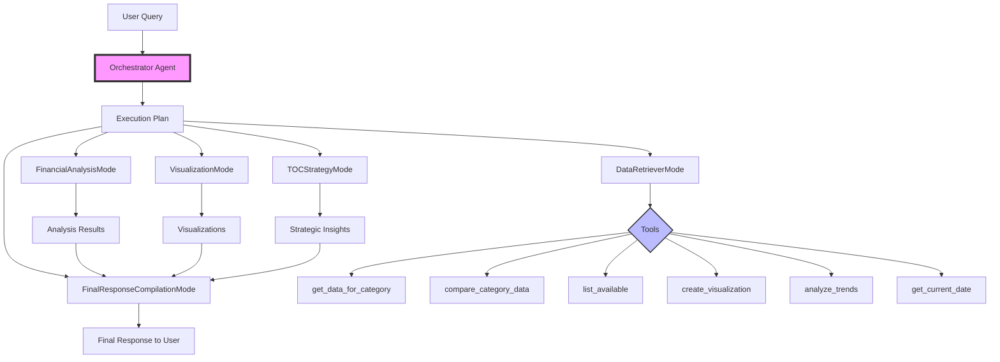
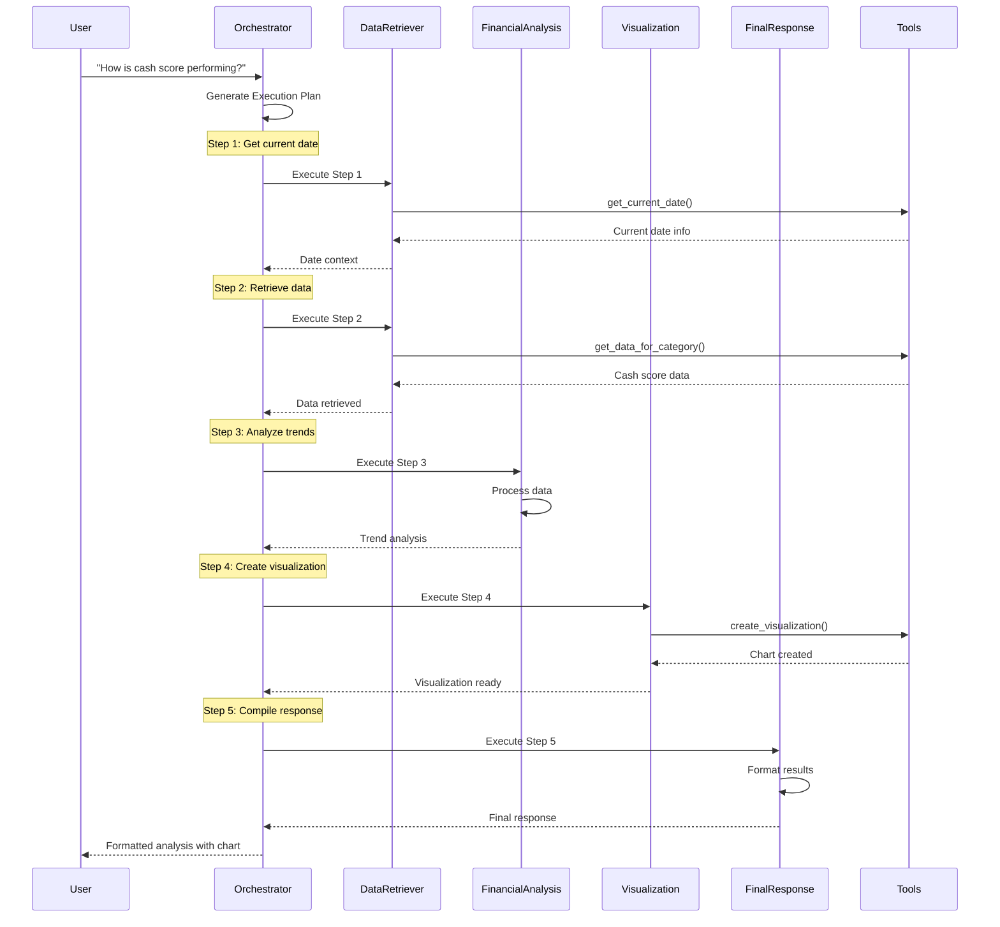

# Jindal Steel TOC Advisor

An advanced AI-powered Theory of Constraints (TOC) advisor built with a multi-agent orchestration system to analyze and provide strategic insights from Excel data for Jindal Steel. This application helps identify bottlenecks, improve throughput, and optimize cash flow based on financial and operational data.

## 🏗️ Architecture Overview

The system uses a sophisticated multi-agent architecture with an orchestrator that coordinates specialized agents to handle complex queries:



## 🔄 Process Flow

Here's how the multi-agent system processes a user query:



## 🤖 Agent Personas

### 1. **Orchestrator Agent**
- **Role**: Plans and coordinates the execution of complex queries
- **Output**: JSON execution plan with steps and dependencies
- **Key Features**:
  - Breaks down complex queries into logical steps
  - Manages dependencies between steps
  - Routes tasks to appropriate specialized agents

### 2. **DataRetrieverMode**
- **Role**: Interfaces with data retrieval tools
- **Tools Used**: 
  - `get_data_for_category`: Fetch specific metric data
  - `compare_category_data`: Compare metrics between categories
  - `list_available`: List available categories/dates/metrics
  - `get_current_date`: Get date context for relative queries

### 3. **FinancialAnalysisMode**
- **Role**: Performs complex financial analysis
- **Capabilities**:
  - Trend analysis with volatility metrics
  - Hero/Zero identification (top/bottom performers)
  - Comparative analysis between categories
  - Performance insights generation

### 4. **VisualizationMode**
- **Role**: Creates data visualizations
- **Chart Types**: Line, Bar, Pie, Scatter
- **Features**:
  - Financial formatting (₹ Cr)
  - Categorical x-axis handling
  - Interactive Plotly charts

### 5. **TOCStrategyMode**
- **Role**: Provides Theory of Constraints strategic insights
- **Focus**: Bottleneck identification and optimization strategies

### 6. **FinalResponseCompilationMode**
- **Role**: Formats and presents the final response
- **Features**:
  - Structured markdown formatting
  - JSON parsing and presentation
  - Insight summarization

## 💻 Technical Implementation

### Key Components

1. **Pydantic Models**: Define structured inputs/outputs for each agent
2. **LangChain Integration**: Powers the orchestrator with GPT-4
3. **Tool System**: Modular tools for data operations
4. **Session State Management**: Maintains conversation context

### Data Flow Example

```python
# User Query: "Show cash score trend for last 3 months"

# 1. Orchestrator generates plan:
{
  "steps": [
    {
      "step_id": 1,
      "persona": "DataRetrieverMode",
      "goal": "Get current date context",
      "inputs": {"tool_to_call": "get_current_date", "tool_input_json": "{}"}
    },
    {
      "step_id": 2,
      "persona": "DataRetrieverMode", 
      "goal": "Retrieve cash score data",
      "inputs": {"tool_to_call": "get_data_for_category", "tool_input_json": "{...}"},
      "depends_on_step": 1
    },
    // ... more steps
  ]
}

# 2. Each step executes with dependency resolution
# 3. Results flow to final compilation
```

## 🚀 Features

- **Multi-Agent Orchestration**: Intelligent task decomposition and execution
- **Theory of Constraints Analysis**: Identify system constraints and bottlenecks
- **Cash Flow Optimization**: Focus on throughput and operational expenses
- **Multi-plant Comparison**: Analyze data across OVERALL, RAIGARH, and ANGUL plants
- **Date Range Analysis**: Query data for specific time periods
- **Advanced Visualizations**: Interactive charts with financial formatting
- **Trend Analysis**: Comprehensive metrics including volatility and insights
- **Hero/Zero Analysis**: Identify top and bottom performing metrics

## 🛠️ Technologies Used

- **Streamlit**: Web interface
- **LangChain**: Orchestrator agent framework
- **OpenAI GPT-4 Turbo**: Powers intelligent planning and analysis
- **Pandas**: Data processing
- **Plotly**: Interactive visualizations
- **Pydantic**: Data validation and schema definition
- **Python 3.x**: Core programming language

## 📊 Data Processing

The system handles Excel files with:
- Dynamic header detection
- Financial value parsing (₹, Cr, commas)
- Multi-category structure (OVERALL, RAIGARH, ANGUL)
- Date period mapping
- Automatic numeric conversion

## 🔧 Installation

1. Clone this repository:
   ```bash
   git clone https://github.com/shiragannavar/jindal-chatbot.git
   cd jindal-chatbot
   ```

2. Create a virtual environment:
   ```bash
   python -m venv venv
   source venv/bin/activate  # On Windows: venv\Scripts\activate
   ```

3. Install dependencies:
   ```bash
   pip install -r requirements.txt
   ```

4. Set up your OpenAI API key:
   ```bash
   echo "OPENAI_API_KEY=your_key_here" > .env
   ```

5. Run the application:
   ```bash
   streamlit run app.py
   ```

## 📝 Example Queries

### Basic Queries
- "What are the available categories?"
- "List all dates for RAIGARH"
- "Show me Cash Score for OVERALL last week"

### Trend Analysis
- "How is the cash score of JSPL performing from last 3 months? Please comment. Also show graphically."
- "Show Net Revenue trend for ANGUL over the last month"
- "Analyze the performance of Production Volume for last quarter"

### Comparative Analysis
- "Compare RAIGARH and ANGUL performance"
- "What's the difference in Cash Score between the two plants?"
- "Show me comparative metrics for all categories"

### Hero/Zero Analysis
- "Show me Hero and Zero areas for last week"
- "What are the top performing metrics for RAIGARH?"
- "Identify bottom performers in ANGUL"

### Strategic TOC Queries
- "What are the main constraints limiting throughput?"
- "How can we improve cash flow based on current data?"
- "What's the key bottleneck affecting performance?"

## 🔄 Recent Updates

- **Multi-Agent System**: Replaced single agent with orchestrator-based architecture
- **Enhanced Trend Analysis**: Added comprehensive metrics and insights
- **Fixed Visualization Issues**: Proper chart_type handling and data formatting
- **Improved Response Formatting**: Structured markdown with clear sections
- **Better Error Handling**: Graceful handling of edge cases
- **Performance Optimization**: Efficient data processing and memory management

## 🤝 Contributing

Contributions are welcome! Please feel free to submit a Pull Request.

## 📄 License

This project is proprietary to Jindal Steel.

## 🙋‍♂️ Support

For issues or questions, please create an issue in the GitHub repository. 